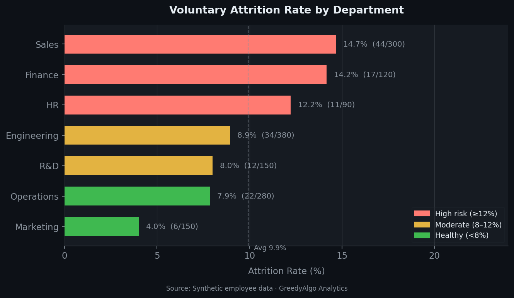
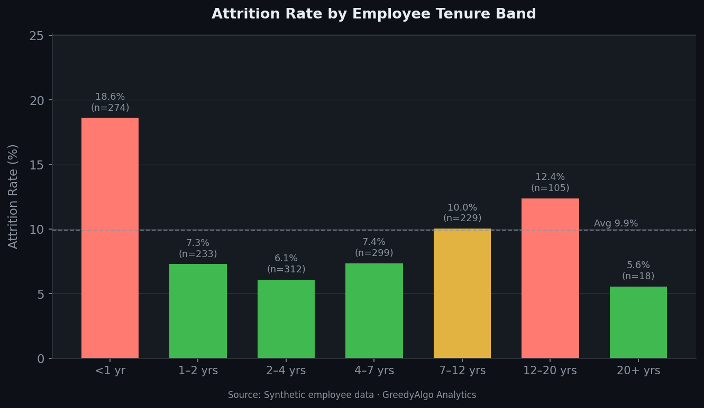
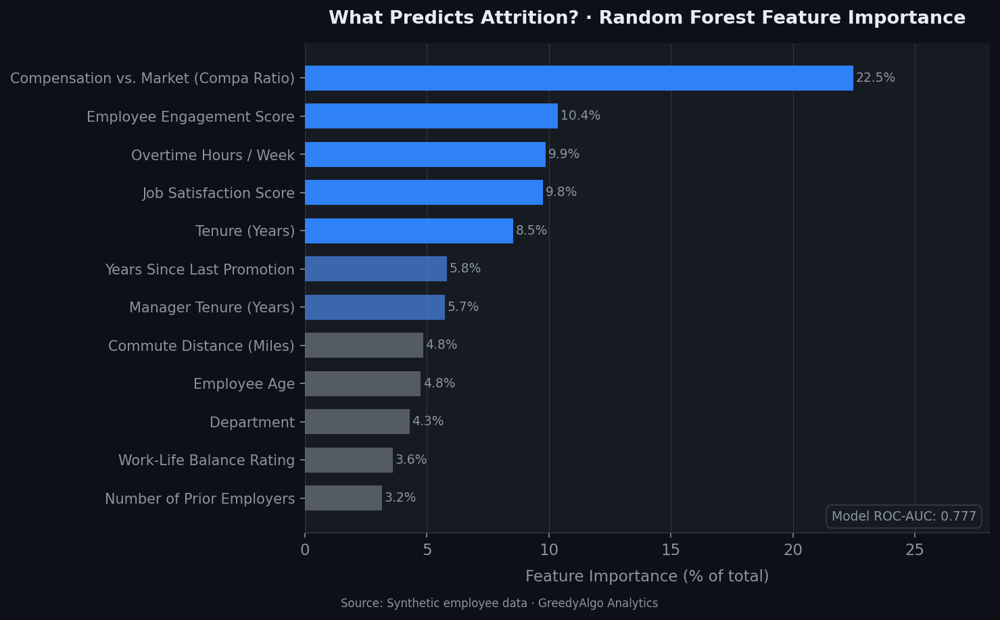

# Employee Attrition Prediction

> *Which employees are most likely to resign in the next 90 days, and what organizational factors are driving their departure?*


**Author:** Hari Vemula · [GreedyAlgo Analytics](https://github.com/harivemula)  
**Analytics Type:** Predictive  
**Business Function:** Employee Experience · Talent Retention  

---

## Key Finding

> **Compensation relative to market (compa ratio) is the single strongest predictor of voluntary attrition — accounting for 22% of the model's predictive power. Employees below market pay (compa ratio < 0.90) attrite at 2.3× the rate of their market-aligned peers.**  
> Sales is the highest-risk department (14.7% attrition rate vs. 9.9% overall), driven by above-average overtime and compensation gaps.

Model ROC-AUC: **0.777** | 5-fold CV AUC: **0.777 ± 0.057**

---

## Sample Output

| Chart | Description |
|-------|-------------|
|  | Attrition rate by department |
|  | Attrition risk by tenure band |
|  | Top predictors (RF feature importance) |

---

## Project Structure

```
pa-attrition-predictor/
├── data/
│   └── raw/
│       └── employee_data.csv       # Synthetic dataset (1,470 employees, 19 features)
├── notebooks/
│   ├── 00_data_generation.ipynb    # Synthetic data generation with realistic distributions
│   ├── 01_eda.ipynb                # Exploratory data analysis — distributions, correlations, early signals
│   ├── 02_analysis.ipynb           # Random Forest model — training, evaluation, feature importance
│   └── 03_insights.ipynb           # Business narrative — flight risk scoring, cost estimates, actions
├── models/
│   └── rf_attrition_model.pkl      # Serialized model + encoders (generated by 02_analysis.ipynb)
├── outputs/
│   └── figures/                    # PNG charts (150 dpi, dark-themed, publication-ready)
├── model_card.md                   # Model documentation for responsible deployment
├── requirements.txt
└── .gitignore
```

---

## Methodology

The dataset (1,470 synthetic employees across 7 departments, 19 features) was designed to mirror realistic HRIS data from a mid-size enterprise. Attrition drivers — compensation, engagement, overtime, tenure, promotion velocity — are embedded with effect sizes grounded in published people analytics literature.

A **Random Forest classifier** was trained on an 80/20 stratified split. Class imbalance (~10% attrition rate) is addressed with `class_weight='balanced'`. The decision threshold is set to 0.40 rather than 0.50 to prioritize recall: in a retention use case, a false positive (flagging a retained employee as at-risk) costs a manager conversation; a false negative (missing an actual flight risk) costs a resignation and replacement fees averaging 50–150% of annual salary.

Feature importances are used in place of SHAP for interpretability, providing a direction-agnostic signal of each feature's contribution to prediction accuracy across all 1,470 employees.

---

## How to Run

```bash
# 1. Clone the repo
git clone https://github.com/harivemula/pa-attrition-predictor.git
cd pa-attrition-predictor

# 2. Install dependencies
pip install -r requirements.txt

# 3. Run notebooks in order
jupyter lab
# Open notebooks/00_data_generation.ipynb → run all
# Continue through 01, 02, 03
```

The notebooks are designed to be run sequentially. `00_data_generation` writes the CSV; subsequent notebooks read it.

---

## Dataset Schema

| Feature | Type | Description |
|---------|------|-------------|
| `employee_id` | str | Synthetic identifier (EMP00001–EMP01470) |
| `age` | int | Employee age (22–62) |
| `gender` | str | Male / Female / Non-binary |
| `department` | str | Sales, Engineering, Operations, Finance, HR, Marketing, R&D |
| `job_level` | int | 1 (IC) to 5 (VP) |
| `tenure_years` | float | Years at the company |
| `salary` | int | Annual base salary (USD) |
| `compa_ratio` | float | Salary ÷ market rate for role (1.0 = at market) |
| `performance_rating` | int | 1–5 performance rating |
| `engagement_score` | float | 1–10 engagement survey score |
| `satisfaction_score` | float | 1–10 job satisfaction |
| `overtime_hours_per_week` | float | Average weekly overtime |
| `years_since_last_promotion` | float | Promotion recency |
| `work_life_balance` | int | 1 (poor) to 4 (excellent) |
| `training_hours_last_year` | int | L&D investment in hours |
| `manager_tenure_years` | float | Manager's tenure at company |
| `num_prior_companies` | int | Job-hopper signal |
| `commute_miles` | int | One-way commute distance |
| `attrited` | int | **Target: 1 = left, 0 = retained** |

---

## Limitations & Future Work

- **Synthetic data only** — patterns are designed in; real-world signal may differ substantially
- **Causal interpretation** — feature importance identifies correlates, not causes; a pay equity audit or randomized intervention is needed before acting on compensation findings
- **Model drift** — workforce composition changes; retrain quarterly
- **Fairness** — run a disparate impact analysis on `gender` and any demographic proxies before deployment; this project does not include a formal fairness evaluation
- **Next step** — replace synthetic data with a Workday RaaS extract → add SHAP waterfall plots for individual employee explanations → deploy as a refreshable dashboard

---

## Related Projects

- [`pa-pay-equity-analysis`](https://github.com/harivemula/pa-pay-equity-analysis) — Statistical pay gap analysis by gender and department
- [`pa-engagement-drivers`](https://github.com/harivemula/pa-engagement-drivers) — Survey driver analysis with NLP open-text processing
- [`pa-headcount-forecast`](https://github.com/harivemula/pa-headcount-forecast) — Time-series headcount forecasting with Prophet

---

*Part of the [People Analytics Portfolio](https://github.com/harivemula) · GreedyAlgo Analytics*
